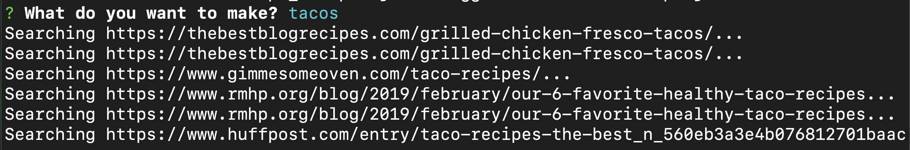
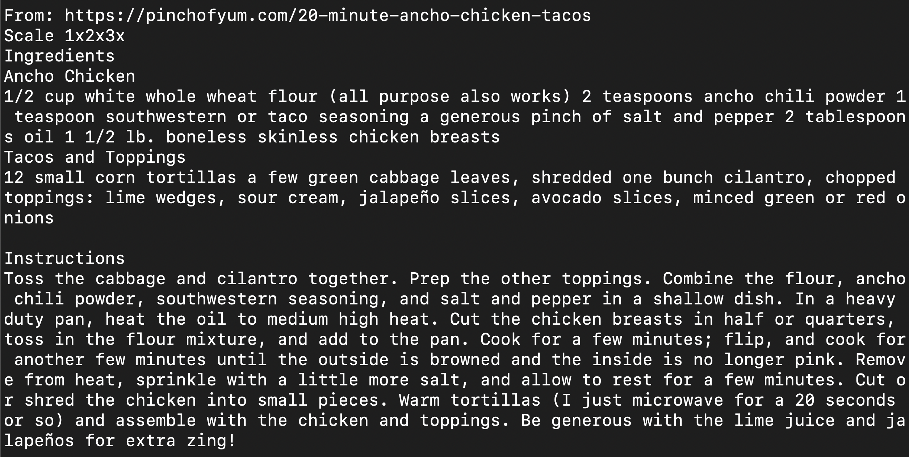
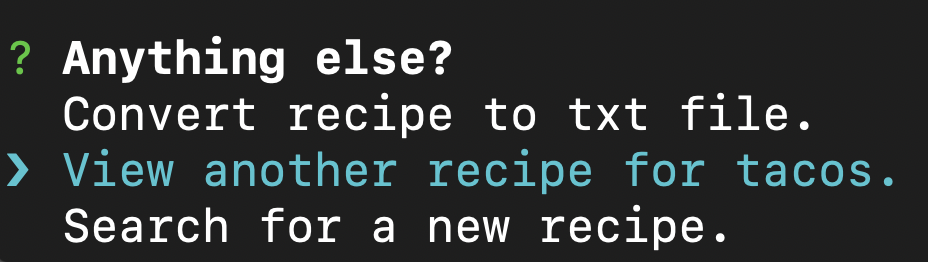
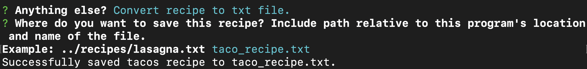

# Recipe Scraper
A simple scraper to get around the fluff stuff (and ads!) in the the standard blog recipes you find on the web today. Gets the ingredients and directions. That's it.
## How To Use:
1. Make sure you have NodeJS installed on your machine.
2. Clone this repo to a directory of your choice. 
3. Run ```npm install``` while in the same directory of this repo to install dependencies. 
4. Then run ```node findRecipe.js``` to run scraper. 
5. Follow the prompts to search for and save recipes. 

## Example Usage:

After running this command in your terminal:


It will ask you what you want to make. We'll say tacos (cause tacos are awesome). The recipe scraper will search google's top results for taco recipes and try to extract just the instructions and ingredients. While it does that it will display the urls it is currently searching, like this: 


After it is done searching, it will display the first recipe it found.


From here, there are a few things you can. Your options are displayed below the recipe. 


You can view another recipe it found if you would like.

Or you can save the recipe to a .txt file by hitting highlighting convert recipe to txt file and hitting enter.


Finally, You can search for another recipe. Hope you enjoy!

## License: 
[MIT](https://choosealicense.com/licenses/mit/)
